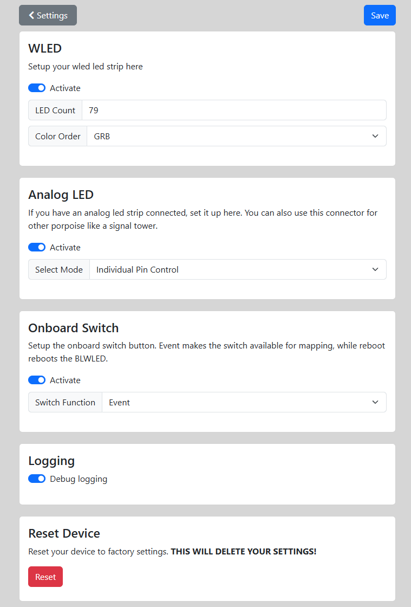

# Device Settings

On this page you can setup various settings for your device. 
**DON'T FORGET TO SAVE YOUR CHANGES!**
  

## WLED
After activating this option, you can set the number of WLED Leds to use and the order of the Leds. The default value for Led color order is set to GRB which should be fine for most WLED strips.
  

## Analog LED
After activating this option, you can select how this output should be handled.
You have the option between LED strip if you have connected a normal "dumb" Led strip or individual pin control, if you want to control the output pins each individually.
  

## Onboard Switch
After activating this option, you can decide if you want the onboard switch to fire an event or if you want to use it as a reboot button.
The event can later be handled under the mappings for the event "Onboard switch pressed"
  

## Logging
Activate this option to log whats happening to log file. For more details, look under the [Log wiki](https://github.com/derDeno/BLWLED/wiki/Debugging) page.
  

## Reset Device
Here you can reset your device to factory settings. This will delete all changes made by you.
  

