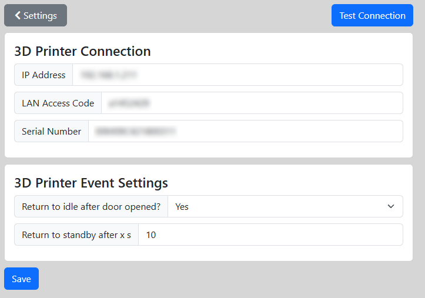

# Printer Settings

On this page you setup the connection to your Printer.
These information can be found on the X1C on the display under Settings.
  

* IP address
  * Settings / Network
* LAN Access Code
  * Settings
* Serial Number
  * Settings / Device Info

 
After saving the values, you can press the "Test Connection" button to check if a connection can be established to your Printer.
  

