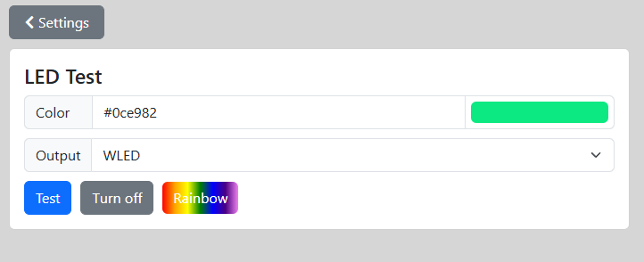

# LED Test Page

The LED test page allows you to directly send a color to the WLED or analog output.
you can enter a RGB hex value or select one using the color picker.

Press "Test" to send the color or "Turn off" to turn the selected output off.  
The Rainbow button is a gimmick to activate an animated rainbow on the WLED output.

